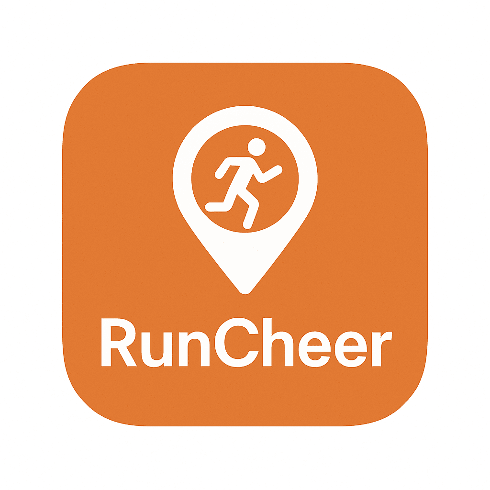

# 🏃 RunCheer - 실시간 마라톤 응원 플랫폼

> **Claude Sonnet 4로 바이브코딩된 프로젝트**  
> 러닝크루와 응원자들을 위한 실시간 마라톤 트래킹 및 응원 서비스



## 📋 프로젝트 개요

**RunCheer**는 마라톤 대회에 참가하는 주자들을 실시간으로 추적하고 응원할 수 있는 웹 애플리케이션입니다. 러닝크루 단위로 그룹을 생성하여 팀원들의 위치를 지도에서 확인하고, 체크포인트 통과 기록을 실시간으로 공유할 수 있습니다.

### 🎯 핵심 기능

- **실시간 주자 추적**: 네이버 지도 API를 활용한 주자 위치 실시간 표시
- **그룹 관리**: 러닝크루 단위의 그룹 생성 및 멤버 관리
- **레디샷 공유**: 대회 전 주자들의 레디샷(Ready Shot) 사진 공유
- **체크포인트 기록**: 5K, 10K, 하프 등 구간별 통과 기록 확인
- **예상 위치 계산**: 페이스 기반 실시간 위치 예측
- **카카오톡 연동**: 카카오 소셜 로그인 및 프로필 연동

## 🚀 주요 특징

### 1. 실시간 트래킹
- **60초 자동 새로고침**: 주자 위치 자동 업데이트
- **배치 API 최적화**: 다수 주자 데이터를 한 번에 조회하여 성능 향상
- **완주 자동 감지**: 완주한 주자는 추적 자동 중단

### 2. 비용 최적화
- **이미지 압축**: 600×600px, 품질 50%로 자동 압축 (평균 50KB)
- **브라우저 캐싱**: event_id 기반 버전 관리로 99.6% 트래픽 절감
- **Vercel Blob Storage**: 효율적인 이미지 저장 및 전송

### 3. 사용자 경험
- **반응형 디자인**: 모바일 최적화 UI
- **직관적인 인터페이스**: 탭 기반 네비게이션 (마이그룹, 응원, 결과)
- **실시간 상태 표시**: 대기/주행/완주 상태 시각화
- **이미지 뷰어**: 레디샷 및 프로필 사진 확대 보기

## 🏗️ 기술 스택

### Frontend
- **Vanilla JavaScript**: 순수 JavaScript로 구현 (프레임워크 미사용)
- **Naver Maps API**: 지도 및 마커 표시
- **Kakao SDK**: 소셜 로그인 및 사용자 인증
- **HTML5 Canvas API**: 이미지 압축 처리

### Backend
- **Vercel Serverless Functions**: API 엔드포인트
- **Neon PostgreSQL**: 데이터베이스
- **Vercel Blob Storage**: 이미지 저장소

### External APIs
- **MyResult API**: 마라톤 기록 데이터 제공
- **Kakao OAuth**: 사용자 인증
- **Naver Maps API**: 지도 서비스

## 📦 프로젝트 구조

```
livetrack/
├── index.html              # 메인 HTML (SPA)
├── privacy.html            # 개인정보 처리방침
├── js/
│   └── app.js             # 메인 애플리케이션 로직 (2,500+ lines)
├── api/                    # Vercel Serverless Functions
│   ├── auth/
│   │   └── token.js       # 카카오 토큰 발급
│   ├── groups/
│   │   ├── index.js       # 그룹 조회/생성
│   │   ├── [code].js      # 특정 그룹 조회
│   │   ├── create-with-member.js  # 그룹+멤버 동시 생성
│   │   ├── join.js        # 그룹 참여
│   │   ├── leave.js       # 그룹 탈퇴
│   │   └── runners.js     # 그룹 멤버 조회
│   ├── users/
│   │   ├── [kakaoId].js   # 사용자 조회/생성
│   │   └── group.js       # 사용자 그룹 조회
│   ├── images/
│   │   └── upload.js      # 이미지 업로드 (Blob)
│   ├── proxy.js           # MyResult API 프록시
│   ├── proxy-batch.js     # 배치 조회 최적화
│   └── _lib/
│       └── handlers.js    # 공통 핸들러 로직
├── schema.sql             # DB 스키마
├── migration_*.sql        # DB 마이그레이션 스크립트
├── course-*.gpx          # GPX 코스 데이터
└── vercel.json           # Vercel 배포 설정
```

## 🗄️ 데이터베이스 스키마

### users
```sql
- kakao_id (PK)          # 카카오 사용자 ID
- name                   # 사용자 이름
- profile_image          # 프로필 이미지 URL
- created_at             # 가입 일시
```

### groups
```sql
- code (PK)              # 4자리 그룹 코드 (예: ABCD)
- name                   # 그룹명
- event_id               # 대회 ID (133: JTBC)
- creator_kakao_id       # 그룹장 카카오 ID
- created_at             # 생성 일시
```

### group_members
```sql
- group_code (FK)        # 그룹 코드
- kakao_id (FK)          # 사용자 카카오 ID
- role                   # 'runner' | 'supporter'
- bib                    # 배번 (주자만)
- photo_url              # 레디샷 URL (주자만)
- joined_at              # 참여 일시
- UNIQUE (group_code, kakao_id)  # 다중 그룹 참여 가능
```

## 🎨 주요 기능 상세

### 1. 그룹 생성 및 관리

#### 그룹 생성 플로우
```
1. 그룹명 입력 (예: "런티풀 러닝크루 응원(JTBC)")
2. 대회 선택 (133: JTBC 서울마라톤)
3. 4자리 랜덤 코드 생성 (중복 체크)
4. 그룹장의 주자 정보 입력 (배번, 레디샷)
5. 이미지 압축 및 업로드 (Blob Storage)
6. 그룹 + 멤버 동시 생성 (트랜잭션)
```

#### 제한 사항
- **전체 그룹**: 최대 300개
- **그룹당 주자**: 최대 50명
- **계정당 그룹**: 1개 가입/생성만 가능
- **응원자**: 무제한

### 2. 실시간 추적 시스템

#### 위치 예측 알고리즘
```javascript
// 마지막 체크포인트 기준 예상 위치 계산
estimatedDistance = lastCheckpoint + (elapsedTime × pace)

// 예시:
// - 마지막 체크포인트: 30km (10:00 통과)
// - 현재 시각: 10:20 (20분 경과)
// - 페이스: 5분/km
// - 예상 위치: 30 + (20/5) = 34km
```

#### 지도 마커 업데이트
```javascript
// 60초마다 자동 새로고침
- 배치 API로 전체 주자 데이터 조회
- 각 주자의 예상 위치 계산
- 네이버 지도 마커 위치 업데이트
- 완주자는 추적 목록에서 제거
```

### 3. 이미지 최적화

#### 압축 프로세스
```javascript
const CONFIG = {
  IMAGE_MAX_WIDTH: 600,
  IMAGE_MAX_HEIGHT: 600,
  IMAGE_QUALITY: 0.5  // 50% 품질
};

// Canvas API를 사용한 리사이징 및 압축
// 평균 크기: 3.4MB → 50KB (98.5% 감소)
```

#### 캐싱 전략
```javascript
// event_id 기반 버전 관리
photoUrl = `${baseUrl}?v=${eventId}`

// 같은 대회 내에서는 브라우저 캐싱 활용
// 예상 Data Transfer 절감: 99.6%
```

## 🔐 보안 및 인증

### 카카오 OAuth 플로우
```
1. 사용자 로그인 버튼 클릭
2. 카카오 인증 페이지로 리다이렉트
3. 사용자 동의 후 인가 코드 발급
4. 서버에서 액세스 토큰 요청
5. 사용자 정보 조회 (닉네임, 프로필)
6. DB에 사용자 생성/업데이트
7. 세션 저장 (localStorage)
```

### 환경 변수
```bash
# Vercel 환경 변수
KAKAO_REST_API_KEY=your_rest_api_key
POSTGRES_URL=your_neon_postgres_url
BLOB_READ_WRITE_TOKEN=your_blob_token
```

## 📊 성능 최적화

### 1. API 호출 최적화
- **Before**: 주자 50명 × 60초 새로고침 = 50 Function 호출/분
- **After**: 배치 API로 1 Function 호출/분
- **절감률**: 98%

### 2. 이미지 전송 최적화
- **Before**: 타임스탬프 방식 → 매번 다운로드 (180GB/대회)
- **After**: event_id 캐싱 → 첫 로드만 (750MB/대회)
- **절감률**: 99.6%

### 3. 데이터베이스 최적화
- 인덱스: `group_code`, `kakao_id`, `event_id`
- 제약 조건: `UNIQUE (group_code, kakao_id)`
- 외래 키: 데이터 무결성 보장

## 🌐 배포

### Vercel 배포
```bash
# Vercel CLI로 배포
vercel --prod

# 자동 배포 (main 브랜치 푸시 시)
git push origin main
```

### 도메인 설정
```
Production: https://livetrack.vercel.app
Custom Domain: (설정 가능)
```

## 🧪 테스트

### 테스트 페이지
- `test.html`: 기본 기능 테스트
- `test-map.html`: 지도 기능 테스트
- `test-estimation.html`: 위치 예측 알고리즘 테스트
- `test_mock.html`: Mock 데이터 테스트

## 📱 지원 대회

### 현재 지원
- **2025 JTBC 서울마라톤** (event_id: 133)
  - 일자: 2025년 11월 2일 08:00
  - 장소: 상암월드컵공원
  - 코스: 풀코스 (42.195km)

### 과거 대회 (검증 완료)
- **2025 춘천마라톤** (event_id: 132) - 제거됨

## 🚨 주의사항

### 사용 제한
- 10km 코스 미지원 (풀코스만)
- 그룹 생성: 최대 300개
- 그룹당 주자: 최대 50명
- 계정당 그룹: 1개만

### 그룹 삭제 정책
- **기준**: 2025년 11월 1일 오후 6시
- **조건**: 주자 2명 미만인 그룹 자동 삭제
- **목적**: 유효한 그룹만 대회 당일 운영

### 대회 당일
- 높은 트래픽으로 인한 불안정 가능성
- 실시간 업데이트 지연 가능
- 오픈베타 버전임을 인지

## 🤝 기여

### 개발 환경 설정
```bash
# 저장소 클론
git clone https://github.com/sdk0213/livetrack.git

# 환경 변수 설정
cp .env.example .env.local

# Vercel 개발 서버 실행
vercel dev
```

### 개발 가이드라인
- ES6+ JavaScript 사용
- 함수형 프로그래밍 지향
- 주석으로 코드 설명
- 커밋 메시지 컨벤션 준수

## 📄 라이선스

이 프로젝트는 개인 프로젝트이며, 상업적 사용을 금지합니다.

## 👨‍💻 개발자

**개발자 성대경**
- Instagram: [@bigkyoung_](https://instagram.com/bigkyoung_)
- Email: 문의하기 (Instagram DM)

## 🎉 프로젝트 히스토리

### v1.0.0.0 (오픈베타) - 2025.10.27
- ✅ 모든 사용자 그룹 생성 권한 개방
- ✅ 그룹 300개, 주자 50명/그룹 제한
- ✅ 이미지 캐싱 최적화 (99.6% 절감)
- ✅ 배치 API 최적화 (98% 절감)
- ✅ 춘천마라톤 검증 완료
- ✅ JTBC 마라톤 준비 완료

### v0.0.0.1 (클로즈베타) - 2025.10.24
- ✅ 춘천마라톤 실전 검증
- ✅ 관리자 전용 그룹 생성
- ✅ 기본 추적 기능 구현

## 🔮 향후 계획

- [ ] 다중 대회 동시 지원
- [ ] 10km 코스 지원
- [ ] 알림 기능 (체크포인트 통과 시)
- [ ] 그룹 채팅 기능
- [ ] 응원 메시지 전송
- [ ] 기록 통계 및 분석
- [ ] PWA(Progressive Web App) 전환

---

**Made with ❤️ by Claude Sonnet 4 & 성대경**

*이 프로젝트는 러닝크루와 마라톤 응원자들을 위한 사랑과 열정으로 만들어졌습니다.*
